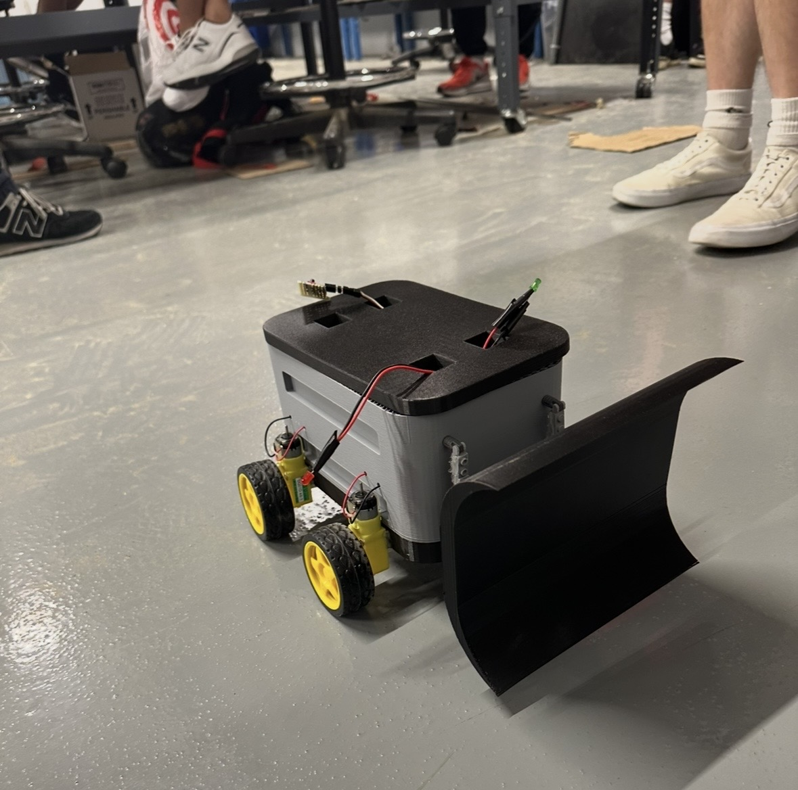

# Fundamentals_of_Engineering_II_Project Arduino Roadway-Clearing Robot

An Arduino-controlled Snow Roomba robot designed and constructed as part of the Fundamentals of Engineering II (Eng 1182) final project.

## Overview

This project involved designing, manufacturing, programming, and testing a prototype robot intended to clear material from residential roadways.

I led a three-person team through the development process, including construction of the body in SolidWorks, circuit integration, programming, and performance testing. The completed prototype used multiple DC and servo motors and was capable of pushing payloads exceeding 5 pounds.

## Final Prototype



## Features

- Arduino-based control system
- Multiple DC motors for robot movement
- Servo-controlled mechanical actuation
- Integrated motor-control circuitry
- C++ control logic
- Payload capacity exceeding 5 pounds

## Hardware

- Arduino microcontroller
- DC motors
- Servo motors
- Motor drivers
- Battery Pack
- Custom 3D Printed frame
- Wheels and drivetrain components

## Software

The robot was programmed in C++ using the Arduino IDE. The control software coordinated the drive motors and servo mechanisms responsible for movement and roadway-clearing operations.

## Circuitry


The final robot successfully pushed a payload exceeding 5 pounds.

## My Contributions

- Led a three-person engineering team
- Assisted with the mechanical design and fabrication of the robot
- Integrated DC motors, servos, and supporting circuitry
- Developed the Arduino control program in C++
- Participated in prototype testing and troubleshooting

## Technologies and Skills

- Arduino
- C++
- Circuit design
- SolidWorks
- Team leadership

## Repository Structure

```text
arduino-roadway-clearing-robot/
├── README.md
├── src/
│   └── snowroomba.ino
├── images/
    ├── completed_robot.jpg
    └── circuitry.jpg
```

## Project Context

This robot was developed by a three-person team as part of a Fundamentals of Engineering course. The repository documents the project and the software used to control the prototype.
